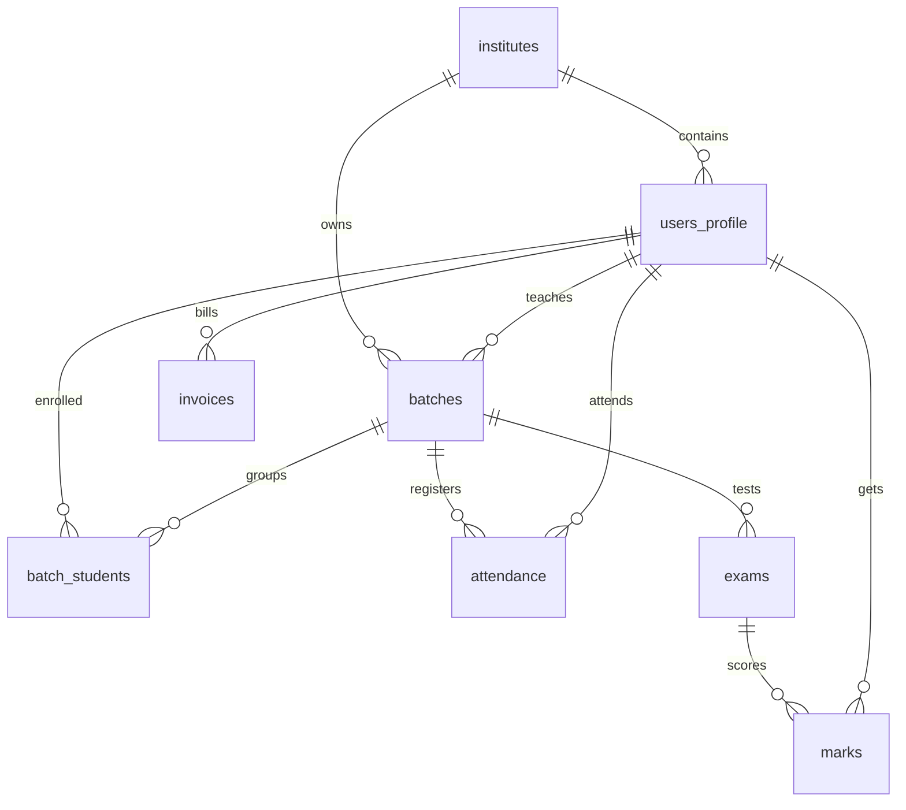

# CoachFlow CRM — Production Edition

A production-ready, high-performance multi-tenant CRM platform for coaching institutes.

CoachFlow empowers super-admins to onboard and monitor institutes, while allowing individual institute administrators, teachers, parents, and students to coordinate schedules, attendance tracking, exams/grades, invoicing, broadcasts, and notification alerts.

---

## 🚀 Architectural & Security Highlights

This production release implements enterprise-grade security and optimization measures:

1. **Robust Security & Cryptography**
   - **Credential Encryption at Rest**: WhatsApp tokens and other sensitive tenant credentials are encrypted symmetrically at the application layer using AES-256-CBC before database storage, using a secret `ENCRYPTION_KEY`.
   - **Fail-Safe Auth Startup**: The server strictly requires a 32-byte `JWT_SECRET` environment variable and will throw a fatal error on startup if missing, eliminating default signature bypasses.
   - **Row-Level Security (RLS)**: Enforced across all 16 relational database tables.
   - **Password Security**: Reset tokens are immediately invalidated on use; passwords are typed and hashed securely using bcrypt rounds.
   - **XSS & Injection Protection**: HTML entity sanitization wraps all user inputs rendered in administrative dashboards.

2. **Performance & Scale**
   - **Declarative Partitioning**: High-volume transaction tables (like `attendance`) are partitioned by date range in PostgreSQL, allowing fast querying and data pruning.
   - **Foreign Key Indexing**: 23 custom indexes are configured across all join relationships, reducing index scan times on growing datasets.
   - **Serialized Query Elimination**: API analytics and dashboards are restructured to query endpoints concurrently using `Promise.all` instead of synchronous bottlenecks.
   - **N+1 Query Resolution**: Heavy database round-trips are eliminated by utilizing PostgREST relation embedding (nested selects) to fetch batch listings and student profiles in a single query.
   - **HTTP Caching**: Standard endpoints return private non-cache headers by default, while analytical statistics carry optimized `Cache-Control` max-age durations.

3. **Code Quality**
   - **Modular Component Design**: God components (like `admin/page.tsx`) have been deconstructed into distinct React tab modules (`DashboardTab`, `RevenueTab`, `MessagesTab`, `StudentsTab`, `ManagementTab`), maintaining a clean sidebar navigation layout.
   - **Reconciliation Safety**: Direct DOM manipulations (such as editing `.innerHTML` directly inside React) are removed in favor of React state maps.
   - **Memory Leak Protection**: Chart.js instances are registered to local canvas references and automatically clean up on unmount inside React `useEffect` destructors.
   - **Supabase Type Safety**: Full typescript interfaces represent table constraints, giving all API queries autocomplete support.

---

## 🛠️ Tech Stack

- **Next.js 14** (App Router, React 18, TypeScript)
- **Supabase (PostgreSQL)** database layers
- **Nodemailer** for production transactional SMTP emails
- **Meta WhatsApp Graph API** for template notification broadcasts
- **Razorpay** for invoice payments webhook receivers
- **Chart.js** for interactive analytics graphs

---

## ⚙️ Setup & Installation

### 1. Configure Environment Variables
Create a `.env` file in the root directory:

```bash
# Supabase connection
NEXT_PUBLIC_SUPABASE_URL="https://your-project.supabase.co"
NEXT_PUBLIC_SUPABASE_ANON_KEY="your-anon-key"
SUPABASE_SERVICE_ROLE_KEY="your-service-role-key"

# Authentication
JWT_SECRET="your-strong-32-byte-secret"

# Cryptographic key (32-byte hex for AES-256-CBC)
ENCRYPTION_KEY="your-32-byte-hex-encryption-key"

# SMTP Settings
SMTP_HOST="smtp.mailtrap.io"
SMTP_PORT=2525
SMTP_USER="smtp-username"
SMTP_PASS="smtp-password"
SMTP_FROM="noreply@coachflow.com"

# Cron Secret
CRON_SECRET="your-cron-secret-token"

# WhatsApp Webhook Verification
WHATSAPP_VERIFY_TOKEN="coachflow_meta_verification"
```

### 2. Install Dependencies
```bash
npm install
```

### 3. Run Database Migrations & Seeding
Apply table structures, database indexes, and seed initial accounts:

```bash
# Run schema and index migrations
npx tsx scripts/db-schema-migrations.ts
npx tsx scripts/add-indexes.ts
npx tsx scripts/create-rpc-size.ts

# Seed mock demo data
npx tsx scripts/seed-supabase.ts
```

### 4. Run Development Server
```bash
npm run dev
```
Open [http://localhost:3000](http://localhost:3000) to view the application.

---

## 🔑 Demo Credentials

After seeding, the database contains the following accounts:

| Role | Email | Password |
| :--- | :--- | :--- |
| **Super Admin** | `admin@platform.test` | `admin123` |
| **Institute Admin** | `admin@brightfuture.test` | `admin123` |
| **Teacher** | `priya@brightfuture.test` | `teacher123` |
| **Student** | `aarav@brightfuture.test` | `student123` |

---

## 📈 Database Schema Overview


